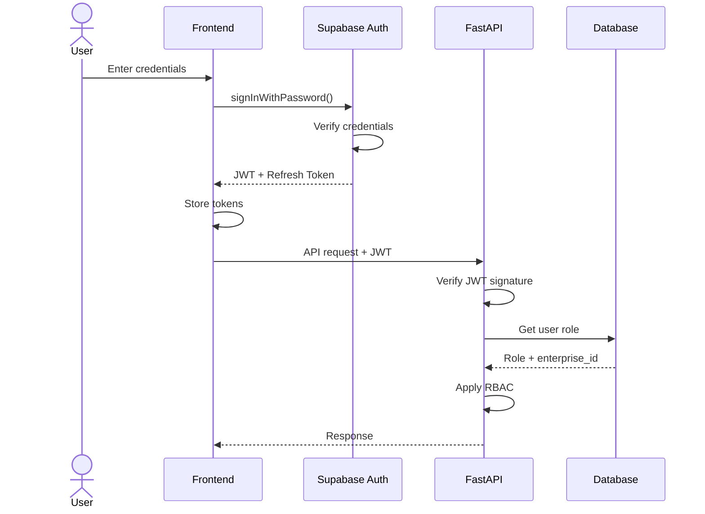

## Overview

Risk Legion uses Supabase Auth (GoTrue) for authentication, providing JWT-based stateless authentication with automatic token refresh and secure session management.

## Authentication Flow



## JWT Token Structure

### Access Token

```json
{
  "aud": "authenticated",
  "exp": 1705123456,
  "iat": 1705119856,
  "iss": "https://your-project.supabase.co/auth/v1",
  "sub": "user-uuid-here",
  "email": "user@example.com",
  "phone": "",
  "app_metadata": {
    "provider": "email",
    "providers": ["email"]
  },
  "user_metadata": {
    "full_name": "John Doe"
  },
  "role": "authenticated",
  "aal": "aal1",
  "amr": [{"method": "password", "timestamp": 1705119856}],
  "session_id": "session-uuid"
}
```

| Claim | Description |
|-------|-------------|
| `sub` | User UUID (primary identifier) |
| `email` | User's email address |
| `exp` | Token expiration timestamp |
| `iat` | Token issued at timestamp |
| `iss` | Token issuer (Supabase project) |

### Token Lifetime

| Token Type | Default Lifetime | Configurable |
|------------|------------------|--------------|
| Access Token | 1 hour | Yes (Supabase dashboard) |
| Refresh Token | 7 days | Yes (Supabase dashboard) |

## Frontend Authentication

### Sign In

```typescript
import { createClient } from '@supabase/supabase-js';

const supabase = createClient(
  import.meta.env.VITE_SUPABASE_URL,
  import.meta.env.VITE_SUPABASE_ANON_KEY
);

async function signIn(email: string, password: string) {
  const { data, error } = await supabase.auth.signInWithPassword({
    email,
    password
  });
  
  if (error) {
    throw new Error(error.message);
  }
  
  return data.session;
}
```

### Sign Out

```typescript
async function signOut() {
  const { error } = await supabase.auth.signOut();
  if (error) {
    throw new Error(error.message);
  }
}
```

### Get Current Session

```typescript
async function getSession() {
  const { data: { session }, error } = await supabase.auth.getSession();
  return session;
}
```

### Listen for Auth Changes

```typescript
supabase.auth.onAuthStateChange((event, session) => {
  switch (event) {
    case 'SIGNED_IN':
      // User signed in
      break;
    case 'SIGNED_OUT':
      // User signed out
      break;
    case 'TOKEN_REFRESHED':
      // Token was automatically refreshed
      break;
    case 'USER_UPDATED':
      // User profile was updated
      break;
  }
});
```

## API Authentication

### Using the Token

All API requests include the JWT in the Authorization header:

```typescript
const token = (await supabase.auth.getSession()).data.session?.access_token;

const response = await fetch('/api/v1/bras', {
  headers: {
    'Authorization': `Bearer ${token}`,
    'Content-Type': 'application/json'
  }
});
```

### Backend Verification

The FastAPI backend verifies tokens:

```python
from fastapi import Depends, HTTPException
from fastapi.security import HTTPBearer, HTTPAuthorizationCredentials
import jwt

security = HTTPBearer()

async def verify_token(
    credentials: HTTPAuthorizationCredentials = Depends(security)
) -> dict:
    token = credentials.credentials
    
    try:
        # Verify JWT signature
        payload = jwt.decode(
            token,
            SUPABASE_JWT_SECRET,
            algorithms=["HS256"],
            audience="authenticated"
        )
        
        # Check expiration
        if payload.get("exp", 0) < time.time():
            raise HTTPException(status_code=401, detail="Token expired")
        
        return payload
        
    except jwt.InvalidTokenError:
        raise HTTPException(status_code=401, detail="Invalid token")
```

## Token Refresh

### Automatic Refresh

Supabase client automatically refreshes tokens:

```typescript
// Token is refreshed automatically before expiration
// No manual refresh needed in most cases

// If you need to force refresh:
const { data, error } = await supabase.auth.refreshSession();
```

### Handling Refresh Failures

```typescript
supabase.auth.onAuthStateChange((event, session) => {
  if (event === 'TOKEN_REFRESHED') {
    // Update any stored token references
    updateApiClient(session?.access_token);
  }
  
  if (event === 'SIGNED_OUT') {
    // Redirect to login
    window.location.href = '/login';
  }
});
```

## Password Management

### Password Reset

```typescript
// Request password reset email
async function requestPasswordReset(email: string) {
  const { error } = await supabase.auth.resetPasswordForEmail(email, {
    redirectTo: 'https://app.risklegion.com/reset-password'
  });
  
  if (error) throw error;
}

// Complete password reset (on redirect page)
async function updatePassword(newPassword: string) {
  const { error } = await supabase.auth.updateUser({
    password: newPassword
  });
  
  if (error) throw error;
}
```

### Password Requirements

| Requirement | Value |
|-------------|-------|
| Minimum Length | 8 characters |
| Complexity | Recommended: uppercase, lowercase, number |
| History | Not enforced by default |

## Session Management

### Session Storage

Sessions are stored in localStorage by default:

```typescript
// Access stored session
const session = localStorage.getItem('sb-{project-ref}-auth-token');
```

### Session Security

| Feature | Implementation |
|---------|----------------|
| HTTPS Only | Enforced in production |
| Token Rotation | Refresh tokens rotated on use |
| Secure Storage | localStorage (can be customized) |

### Session Timeout Recommendations

<Info>
Session management enhancements (15-minute inactivity timeout, auto-logout on tab close) are ready for implementation. See docs/SESSION_MANAGEMENT_IMPLEMENTATION_COMPLETE.md
</Info>

## Multi-Device Sessions

Users can have multiple active sessions across devices:

- Each device gets its own access/refresh token pair
- Sign out on one device doesn't affect others
- "Sign out everywhere" revokes all sessions

```typescript
// Sign out from all devices
await supabase.auth.signOut({ scope: 'global' });
```

## Error Handling

### Common Authentication Errors

| Error | Code | Resolution |
|-------|------|------------|
| Invalid credentials | 400 | Check email/password |
| User not found | 400 | Verify user exists |
| Token expired | 401 | Refresh or re-login |
| Invalid token | 401 | Re-authenticate |
| Email not confirmed | 400 | Check email for confirmation |

### Error Handling Example

```typescript
try {
  await signIn(email, password);
} catch (error) {
  if (error.message.includes('Invalid login credentials')) {
    showError('Invalid email or password');
  } else if (error.message.includes('Email not confirmed')) {
    showError('Please confirm your email first');
  } else {
    showError('Login failed. Please try again.');
  }
}
```

## Security Best Practices

<AccordionGroup>
  <Accordion title="Token Storage">
    - Use httpOnly cookies for highest security (requires setup)
    - Clear tokens on sign out
    - Don't expose tokens in URLs
    - Never log tokens
  </Accordion>
  
  <Accordion title="Session Management">
    - Implement session timeout for sensitive operations
    - Consider re-authentication for critical actions
    - Monitor for suspicious session patterns
    - Use secure session storage
  </Accordion>
  
  <Accordion title="Password Security">
    - Enforce strong password requirements
    - Use password managers
    - Consider MFA (future enhancement)
    - Regular password rotation policies
  </Accordion>
  
  <Accordion title="API Security">
    - Always verify tokens server-side
    - Check token expiration
    - Validate token audience and issuer
    - Log authentication failures
  </Accordion>
</AccordionGroup>

## Related Documentation

- [RBAC](/architecture/rbac) - Role-based access control
- [API Authentication](/api-reference/authentication) - API-specific auth details
- [Supabase Auth Docs](https://supabase.com/docs/guides/auth) - Official Supabase documentation
