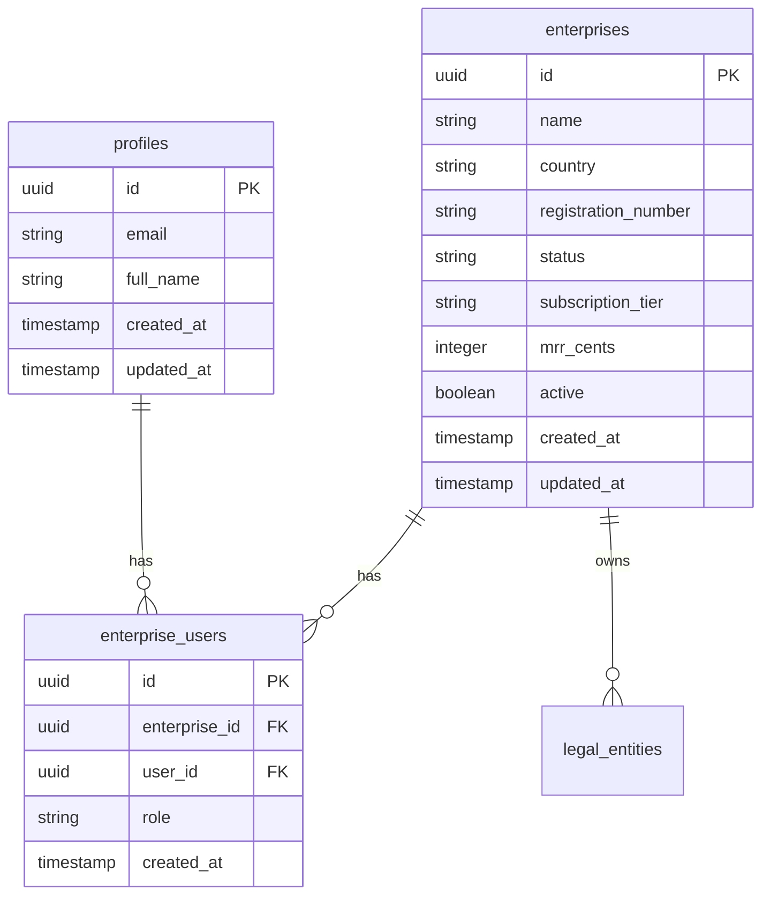
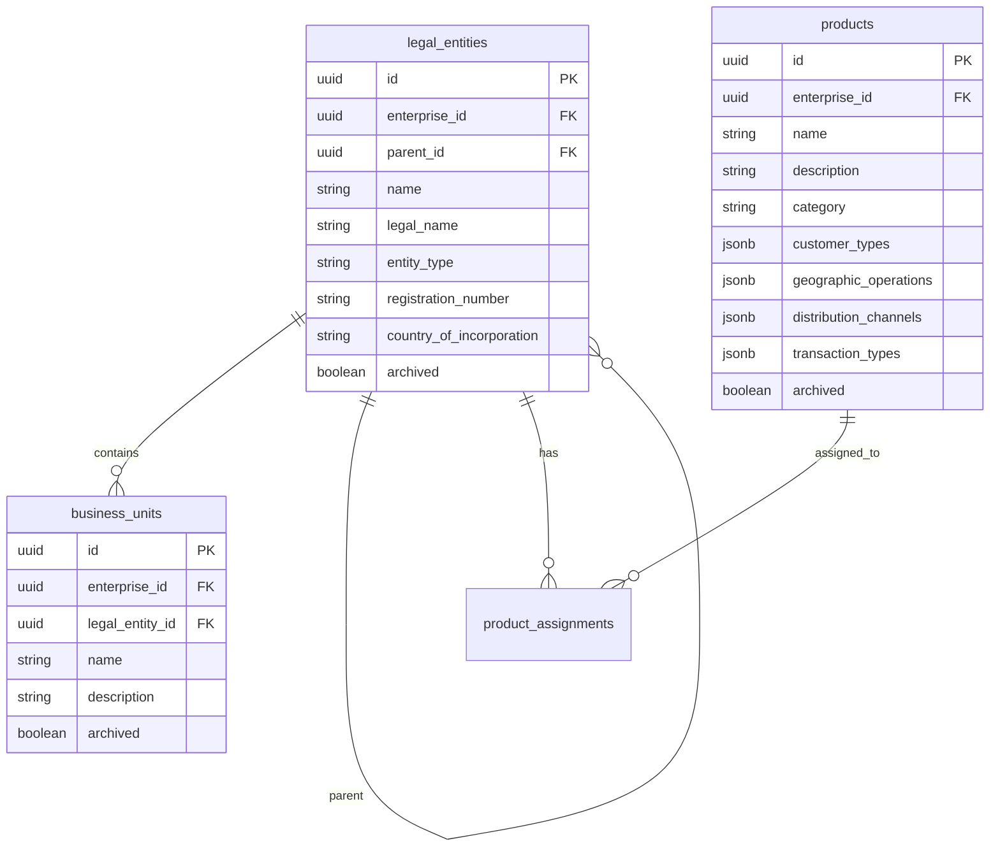
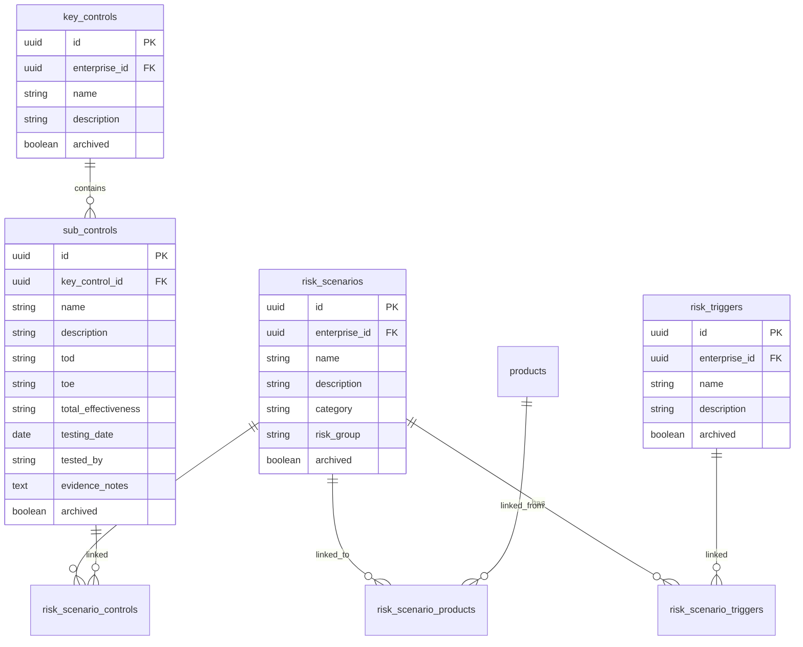
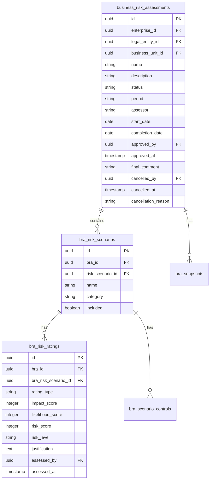

## Overview

Risk Legion uses PostgreSQL (via Supabase) with a normalized schema design. The database implements Row-Level Security (RLS) for multi-tenant data isolation and comprehensive audit logging.

## Schema Design Principles

| Principle | Implementation |
|-----------|----------------|
| **Normalization** | Third Normal Form (3NF) for data integrity |
| **UUID Keys** | UUID primary keys for distributed compatibility |
| **Soft Deletes** | `archived` flags preserve audit trail |
| **Timestamps** | `created_at`, `updated_at` on all tables |
| **Multi-Tenancy** | `enterprise_id` for tenant isolation |

## Core Tables

### Enterprise & User Management



#### `enterprises`
Top-level tenant organization.

| Column | Type | Description |
|--------|------|-------------|
| `id` | UUID | Primary key |
| `name` | VARCHAR | Enterprise display name |
| `country` | VARCHAR | Country code |
| `registration_number` | VARCHAR | Business registration |
| `status` | VARCHAR | active, inactive, suspended |
| `subscription_tier` | VARCHAR | starter, professional, enterprise |
| `mrr_cents` | INTEGER | Monthly recurring revenue (cents) |

#### `enterprise_users`
Links users to enterprises with roles.

| Column | Type | Description |
|--------|------|-------------|
| `enterprise_id` | UUID FK | Reference to enterprises |
| `user_id` | UUID FK | Reference to profiles |
| `role` | VARCHAR | admin, assessor, reviewer |

### Organization Structure



#### `legal_entities`
Legal organizational units with hierarchical structure.

| Column | Type | Description |
|--------|------|-------------|
| `parent_id` | UUID FK | Self-reference for hierarchy |
| `entity_type` | VARCHAR | Bank, Insurance, Investment Firm |
| `country_of_incorporation` | VARCHAR | Jurisdiction |

#### `business_units`
Operational divisions within legal entities.

#### `products`
Financial products with JSONB arrays for flexible attributes.

### Risk Library



#### `risk_scenarios`
Risk scenario definitions.

| Column | Type | Description |
|--------|------|-------------|
| `category` | VARCHAR | Credit, Operational, Compliance, etc. |
| `risk_group` | VARCHAR | Optional grouping |

#### `sub_controls`
Control instances with effectiveness ratings.

| Column | Type | Description |
|--------|------|-------------|
| `tod` | VARCHAR | Test of Design (A-E) |
| `toe` | VARCHAR | Test of Effectiveness (1-5) |
| `total_effectiveness` | VARCHAR | Calculated effectiveness |
| `testing_date` | DATE | When control was tested |

### Business Risk Assessments



#### `business_risk_assessments`
Master BRA record.

| Column | Type | Description |
|--------|------|-------------|
| `status` | VARCHAR | draft, in_progress, under_review, approved, cancelled |
| `approved_by` | UUID FK | User who approved |
| `approved_at` | TIMESTAMP | Approval timestamp |

#### `bra_risk_ratings`
Risk ratings (inherent and residual).

| Column | Type | Description |
|--------|------|-------------|
| `rating_type` | VARCHAR | inherent, residual |
| `impact_score` | INTEGER | 1-5 |
| `likelihood_score` | INTEGER | 1-5 |
| `risk_score` | INTEGER | Calculated (1-25) |
| `risk_level` | VARCHAR | Low, Medium, High, Very High |

### Mitigation Actions

```sql
CREATE TABLE mitigation_actions (
    id UUID PRIMARY KEY DEFAULT gen_random_uuid(),
    enterprise_id UUID NOT NULL REFERENCES enterprises(id),
    bra_id UUID REFERENCES business_risk_assessments(id),
    bra_risk_scenario_id UUID REFERENCES bra_risk_scenarios(id),
    action TEXT NOT NULL,
    owner VARCHAR(255) NOT NULL,
    status VARCHAR(50) DEFAULT 'created',
    priority VARCHAR(50) NOT NULL,
    due_date DATE NOT NULL,
    action_type VARCHAR(100),
    archived BOOLEAN DEFAULT FALSE,
    created_at TIMESTAMPTZ DEFAULT NOW(),
    updated_at TIMESTAMPTZ DEFAULT NOW()
);
```

### Audit Log

```sql
CREATE TABLE audit_log (
    id UUID PRIMARY KEY DEFAULT gen_random_uuid(),
    enterprise_id UUID REFERENCES enterprises(id),
    user_id UUID NOT NULL,
    action_type VARCHAR(50) NOT NULL,
    entity_type VARCHAR(100) NOT NULL,
    entity_id UUID,
    action_details JSONB,
    ip_address INET,
    user_agent TEXT,
    status VARCHAR(50) DEFAULT 'success',
    created_at TIMESTAMPTZ DEFAULT NOW()
);
```

<Warning>
The audit_log table is immutable. No UPDATE or DELETE operations are permitted.
</Warning>

### BRA Snapshots

```sql
CREATE TABLE bra_snapshots (
    id UUID PRIMARY KEY DEFAULT gen_random_uuid(),
    bra_id UUID NOT NULL REFERENCES business_risk_assessments(id),
    snapshot_type VARCHAR(50) NOT NULL,
    snapshot_data JSONB NOT NULL,
    created_by UUID NOT NULL,
    created_at TIMESTAMPTZ DEFAULT NOW()
);
```

| snapshot_type | Description |
|--------------|-------------|
| `creation` | Initial snapshot when BRA created |
| `approval` | Immutable snapshot when BRA approved |

## Layer 2: Historical Data

### `le_assessed_risk_scenarios`

Stores historical assessment data for efficiency:

```sql
CREATE TABLE le_assessed_risk_scenarios (
    id UUID PRIMARY KEY DEFAULT gen_random_uuid(),
    enterprise_id UUID NOT NULL,
    legal_entity_id UUID NOT NULL,
    business_unit_id UUID,
    risk_scenario_id UUID NOT NULL,
    last_inherent_impact INTEGER,
    last_inherent_likelihood INTEGER,
    last_inherent_score INTEGER,
    last_residual_impact INTEGER,
    last_residual_likelihood INTEGER,
    last_residual_score INTEGER,
    last_assessed_at TIMESTAMPTZ,
    last_bra_id UUID,
    created_at TIMESTAMPTZ DEFAULT NOW(),
    updated_at TIMESTAMPTZ DEFAULT NOW()
);
```

**Purpose:**
- Pre-fills new BRAs with previous assessment data
- Enables trend analysis without querying all historical BRAs
- Updated automatically when BRAs are approved

## Indexes

Risk Legion uses strategic indexes for performance:

```sql
-- Enterprise isolation
CREATE INDEX idx_bras_enterprise ON business_risk_assessments(enterprise_id);
CREATE INDEX idx_legal_entities_enterprise ON legal_entities(enterprise_id);
CREATE INDEX idx_products_enterprise ON products(enterprise_id);

-- BRA queries
CREATE INDEX idx_bra_risk_scenarios_bra ON bra_risk_scenarios(bra_id);
CREATE INDEX idx_bra_risk_ratings_bra ON bra_risk_ratings(bra_id);
CREATE INDEX idx_bra_risk_ratings_scenario ON bra_risk_ratings(bra_risk_scenario_id);

-- Control queries
CREATE INDEX idx_sub_controls_key_control ON sub_controls(key_control_id);

-- Action queries
CREATE INDEX idx_mitigation_actions_status ON mitigation_actions(status);
CREATE INDEX idx_mitigation_actions_due_date ON mitigation_actions(due_date);

-- Audit queries
CREATE INDEX idx_audit_log_enterprise ON audit_log(enterprise_id);
CREATE INDEX idx_audit_log_created ON audit_log(created_at);
```

## Row-Level Security

### RLS Policies

Every table has RLS policies enforcing tenant isolation:

```sql
-- Example: BRA access policy
CREATE POLICY "Users can access their enterprise BRAs"
ON business_risk_assessments
FOR ALL
USING (
    enterprise_id IN (
        SELECT enterprise_id
        FROM enterprise_users
        WHERE user_id = auth.uid()
    )
);

-- Example: Entity-scoped access for Assessors
CREATE POLICY "Assessors see only assigned entities"
ON business_risk_assessments
FOR SELECT
USING (
    legal_entity_id IN (
        SELECT legal_entity_id
        FROM user_entity_roles
        WHERE user_id = auth.uid()
    )
    OR
    EXISTS (
        SELECT 1 FROM enterprise_users
        WHERE user_id = auth.uid()
        AND role = 'admin'
    )
);
```

### RLS Hierarchy

```
Super Admin → All enterprises (via separate table)
     ↓
Client Admin → All entities within enterprise
     ↓
Assessor/Reviewer → Assigned entities only
```

## Database Triggers

### Automatic Timestamps

```sql
CREATE OR REPLACE FUNCTION update_updated_at()
RETURNS TRIGGER AS $$
BEGIN
    NEW.updated_at = NOW();
    RETURN NEW;
END;
$$ LANGUAGE plpgsql;

CREATE TRIGGER update_bras_updated_at
BEFORE UPDATE ON business_risk_assessments
FOR EACH ROW EXECUTE FUNCTION update_updated_at();
```

### Risk Score Calculation

```sql
CREATE OR REPLACE FUNCTION calculate_risk_score()
RETURNS TRIGGER AS $$
BEGIN
    NEW.risk_score = NEW.impact_score * NEW.likelihood_score;
    NEW.risk_level = CASE
        WHEN NEW.risk_score <= 4 THEN 'Low'
        WHEN NEW.risk_score <= 9 THEN 'Medium'
        WHEN NEW.risk_score <= 15 THEN 'High'
        ELSE 'Very High'
    END;
    RETURN NEW;
END;
$$ LANGUAGE plpgsql;
```

## Data Retention

| Data Type | Retention Period |
|-----------|------------------|
| Active BRAs | Indefinite |
| Approved BRA Snapshots | 7 years minimum |
| Audit Logs | 7 years minimum |
| Archived Records | 7 years from archive date |
| Session Data | 24 hours |
