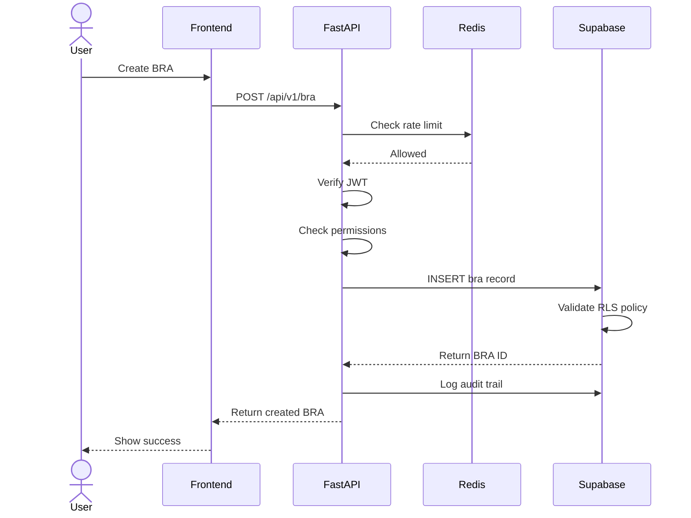
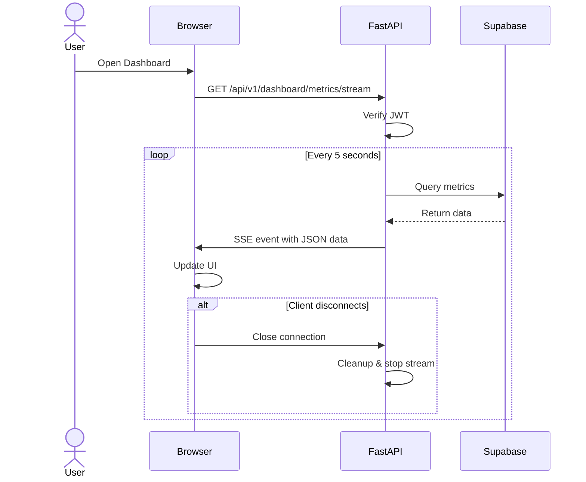
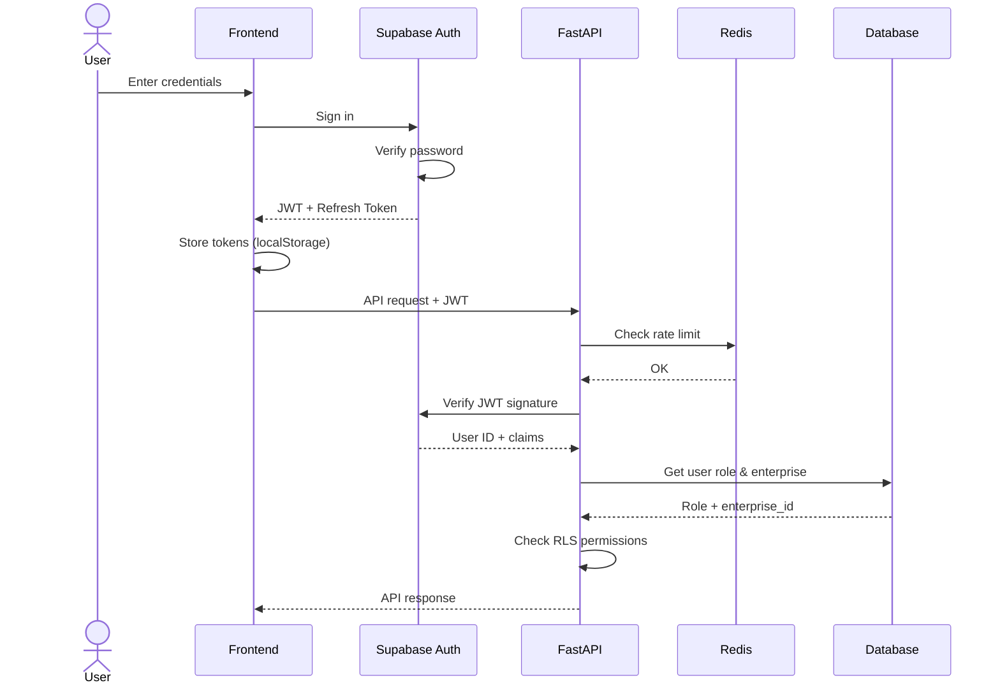

## System Architecture

Risk Legion is a **cloud-native, production-ready** platform built with modern DevOps practices, containerization, and real-time capabilities.

## Architecture Layers

### 1. Frontend Layer

**Technology**: React 18 + TypeScript + Vite

The frontend is a single-page application (SPA) deployed on **Vercel Edge Network**:

- **Build Tool**: Vite 5.4.19 (lightning-fast HMR)
- **State Management**: TanStack Query v5 for server state
- **Routing**: React Router v6 with SPA rewrites
- **UI Framework**: shadcn/ui (Radix UI primitives) + Tailwind CSS
- **Data Tables**: AG Grid 35.0.0 (enterprise-grade tables)
- **Charts**: Recharts 2.15.4
- **Forms**: React Hook Form + Zod validation
- **Real-time**: SSE (Server-Sent Events) client

**Key Directories**:
```
risk-legion-frontend/src/
├── pages/          # Route components
├── components/     # Reusable UI components
├── hooks/          # Custom React hooks (useQuery, useMutation)
├── services/       # API client services
├── contexts/       # React context providers
├── lib/            # Utility functions
└── integrations/   # Supabase integration
```

**Deployment**:
- Platform: Vercel (with automatic deployments)
- Rewrites configured for SPA routing
- Preview deployments for pull requests

### 2. API Layer

#### FastAPI Backend

**Technology**: Python 3.11 + FastAPI + Uvicorn

Production-grade RESTful API with real-time capabilities:

- **Framework**: FastAPI 0.104.1 (async-first)
- **ASGI Server**: Uvicorn with 4 workers in production
- **Validation**: Pydantic 2.5.0 (type-safe models)
- **Real-time**: Server-Sent Events (SSE) + WebSocket support
- **Documentation**: Auto-generated OpenAPI 3.0 Swagger UI
- **Middleware**: CORS, rate limiting, authentication, audit logging
- **Package Manager**: uv (ultra-fast Rust-based package installer)

**Key Directories**:
```
backend/app/
├── routers/        # API route handlers
│   └── v1/         # API version 1
├── services/       # Business logic layer
├── models/         # Pydantic models
├── middleware/     # Custom middleware (auth, rate limit)
├── config.py       # Configuration management
└── main.py         # Application entry point
```

**Real-time Features**:

1. **Server-Sent Events (SSE)**:
   ```python
   # Endpoint: GET /api/v1/dashboard/metrics/stream
   # Updates every 5 seconds
   # Auto-detects client disconnection
   # Headers: text/event-stream, keep-alive
   ```

2. **WebSocket**:
   ```python
   # Endpoint: GET /ws/
   # Bidirectional communication
   # Connection manager for broadcasts
   # Extensible message handling
   ```

#### Redis

**Technology**: Redis 7-alpine

In-memory data store for performance optimization:

- **Use Cases**: Rate limiting, session caching, pub/sub messaging
- **Configuration**:
  - Persistence enabled (`appendonly yes`)
  - Memory limit: 256MB with LRU eviction
  - Port: 6379
- **Rate Limiting**: 100 requests/minute per user/IP (via slowapi)
- **Graceful Fallback**: In-memory storage if Redis unavailable

### 3. Data Layer

#### PostgreSQL Database

**Technology**: Supabase PostgreSQL (v15+)

Database design principles:
- **Normalized Schema**: Third normal form (3NF)
- **UUID Primary Keys**: For distributed systems
- **Soft Deletes**: Audit trail preservation
- **Timestamps**: created_at, updated_at on all tables
- **Triggers**: Automatic timestamp updates

**Core Tables**:
- `enterprises`: Multi-tenant organization data
- `profiles`: User profile information
- `enterprise_users`: User-enterprise-role mapping
- `business_risk_assessments`: BRA master records
- `risks`: Individual risk records
- `key_controls`: Control library (80+ pre-built controls)
- `sub_controls`: Control instances with ToD/ToE assessments
- `risk_appetite`: Risk tolerance configuration
- `action_plans`: Risk mitigation actions
- `audit_logs`: Complete audit trail

#### Row-Level Security (RLS)

All tables enforce multi-tenancy isolation:
- **Tenant Isolation**: Users can only access their enterprise data
- **Role-Based Filtering**: Different permissions per role
- **Audit Trail**: All changes are logged

Example RLS Policy:
```sql
-- Users can only see BRAs from their enterprise
CREATE POLICY "Users can view their enterprise BRAs"
ON business_risk_assessments FOR SELECT
USING (
  enterprise_id IN (
    SELECT enterprise_id
    FROM enterprise_users
    WHERE user_id = auth.uid()
  )
);
```

#### Supabase Auth

**Technology**: GoTrue (Supabase Auth)

Authentication features:
- **JWT Tokens**: Signed with HS256
- **Session Management**: Refresh token rotation
- **Email Confirmation**: Optional email verification
- **Password Reset**: Secure reset flow

## CI/CD & DevOps

### Docker Containerization

**Multi-stage Dockerfile**:

```dockerfile
# Stage 1: Builder (Python 3.11-slim)
- Install uv package manager
- Install dependencies (build-essential, libpq-dev)
- Create optimized dependency layer

# Stage 2: Runtime
- Minimal production image
- nginx for reverse proxy
- Non-root user (appuser:1000)
- Health check on /health endpoint
- Uvicorn with 4 workers
- Exposed port: 8000
```

**Docker Compose** (Local Development):
```yaml
services:
  backend:
    build: .
    ports: ["8000:8000"]
    volumes: [".:/app"]  # Hot reload
    depends_on: [redis]

  redis:
    image: redis:7-alpine
    ports: ["6379:6379"]
    volumes: ["redis-data:/data"]
    command: --appendonly yes --maxmemory 256mb
```

### GitHub Actions CI/CD Pipeline

**File**: `.github/workflows/backend-deploy.yml`

Complete 4-job pipeline:

#### Job 1: Setup
- Converts image names to lowercase for GHCR compatibility

#### Job 2: Test (Quality Assurance)
- **Linting**: ruff (Rust-based, super-fast)
- **Type Checking**: mypy in strict mode
- **Unit Tests**: pytest with coverage
- **Integration Tests**: Full API testing
- **Coverage Report**: Uploaded to Codecov
- **Artifacts**: HTML coverage reports, test results XML

#### Job 3: Build & Push to GHCR
- **Container Registry**: GitHub Container Registry (ghcr.io)
- **Authentication**: GITHUB_TOKEN (automatic)
- **Image Naming**: `ghcr.io/{owner}/risk-legion-api`
- **Tagging Strategy**:
  - Branch names (main, staging)
  - Pull request numbers
  - Semantic versioning
  - Commit SHA with branch prefix
- **Build Platform**: linux/amd64 (EC2 compatible)
- **Caching**: GitHub Actions cache for build layers
- **Security Scanning**: Trivy vulnerability scanner
  - Scans for CRITICAL and HIGH vulnerabilities
  - Uploads results to GitHub Code Scanning (SARIF format)

#### Job 4: Deploy to EC2
- **Conditional**: Only runs on main/staging branches
- **AWS Integration**:
  - Configures AWS credentials
  - Region: eu-north-1 (configurable)
- **Environment Logic**:
  - **Staging**: Port 8001, staging-api.risklegion.com, tag: staging
  - **Production**: Port 8000, api.risklegion.com, tag: main
- **Deployment Steps**:
  1. Auto-install Docker on EC2 if missing
  2. Create/reuse Redis container with health checks
  3. Pull latest image from GHCR
  4. Create environment file with secrets
  5. Deploy container with volume mounts:
     - `/opt/risk-legion/{env}/logs:/app/logs`
     - `/opt/risk-legion/{env}/data:/app/data`
  6. Configure nginx reverse proxy
  7. Set up systemd service (production only)
  8. Prune old images (keep last 3)
- **Health Checks**: 10 retries, 5-second intervals

**Secrets Used**:
```
AWS_ACCESS_KEY_ID, AWS_SECRET_ACCESS_KEY
EC2_HOST, EC2_USER, EC2_SSH_KEY, EC2_SSH_PORT
SUPABASE_URL, SUPABASE_ANON_KEY, SUPABASE_SERVICE_ROLE_KEY
DATABASE_URL, SECRET_KEY
SENTRY_DSN (error tracking)
GH_PAT (GitHub Personal Access Token)
```

### Deployment Architecture

```
Production Environment:
├── Frontend (Vercel Edge Network)
│   ├── Global CDN distribution
│   ├── Automatic HTTPS
│   └── Preview deployments for PRs
│
├── Backend (AWS EC2)
│   ├── Docker containers
│   ├── Nginx reverse proxy
│   ├── Systemd service management
│   └── Auto-restart policies
│
├── Redis (EC2 co-located)
│   ├── Persistent storage
│   └── Health monitoring
│
└── Supabase (Cloud SaaS)
    ├── PostgreSQL database
    ├── Auth service
    └── Automatic backups
```

## Data Flow

### BRA Creation Flow



### Real-time Dashboard Updates (SSE)



## Security Architecture

### Authentication Flow



### Authorization Layers

1. **Network Level**: CORS configuration (allowed origins)
2. **Rate Limiting**: Redis-backed (100 req/min per user/IP)
3. **API Level**: JWT verification middleware
4. **Route Level**: Role-based decorators
5. **Database Level**: RLS policies (automatic)
6. **Business Logic**: Service-level permission checks

### Security Features

- **HTTPS Enforcement**: Automatic via Vercel & nginx
- **CORS Protection**: Whitelist-based origins
- **Rate Limiting**: Prevents API abuse
- **Input Validation**: Pydantic models
- **SQL Injection Protection**: Parameterized queries
- **XSS Protection**: React escapes all user input
- **CSRF Protection**: JWT-based (stateless)
- **Secret Management**: GitHub Secrets, AWS Secrets Manager
- **Vulnerability Scanning**: Trivy in CI/CD
- **Error Tracking**: Sentry integration

## Performance Optimization

### Frontend Optimizations

- **Code Splitting**: Route-based lazy loading
- **Query Caching**: TanStack Query with stale-while-revalidate
- **Optimistic Updates**: Immediate UI feedback
- **Debouncing**: Search and filter operations
- **Memoization**: React.memo for expensive components
- **CDN**: Vercel Edge Network (global distribution)

### Backend Optimizations

- **Async/Await**: FastAPI's async-first approach
- **Connection Pooling**: Supabase connection pool
- **Database Indexing**: Strategic indexes on foreign keys
- **Query Optimization**: Efficient JOIN operations
- **Redis Caching**: Frequently accessed data
- **Batch Operations**: Bulk inserts/updates

### Database Optimizations

- **Materialized Views**: Pre-computed aggregations
- **Partial Indexes**: For filtered queries
- **JSONB Columns**: Flexible schema data
- **Foreign Key Indexes**: Automatic on all FKs
- **Prepared Statements**: Query plan caching

## Monitoring & Observability

### Application Monitoring

- **Frontend**:
  - Error boundaries
  - Sentry integration (optional)
  - Vercel Analytics
- **Backend**:
  - Structured logging (structlog)
  - Prometheus metrics
  - Sentry error tracking
  - Health check endpoint (`/health`)
- **Infrastructure**:
  - Docker container logs
  - AWS CloudWatch (optional)
  - Nginx access logs

### Health Checks

- **API Health**: `GET /health` (30s interval in Docker)
- **Redis**: redis-cli ping (health check in compose)
- **Database**: Connection pool monitoring
- **Frontend**: Uptime monitoring via Vercel

### Audit Trail

All critical operations logged in `audit_logs` table:
- User actions (CREATE, UPDATE, DELETE)
- IP address and user agent
- Timestamp and correlation ID
- Entity type and entity ID
- Action details (JSON payload)

## Technology Stack Summary

### Frontend
- React 18.3.1 + TypeScript 5.8.3
- Vite 5.4.19 (build tool)
- TanStack Query 5.83.0 (data fetching)
- shadcn/ui + Tailwind CSS
- AG Grid 35.0.0 (tables)
- Recharts 2.15.4 (charts)
- Vercel (deployment)

### Backend
- FastAPI 0.104.1 + Python 3.11
- Uvicorn 0.24.0 (4 workers)
- Pydantic 2.5.0 (validation)
- Redis 7-alpine (caching, rate limiting)
- uv (package management)
- Docker + Docker Compose

### Database & Auth
- Supabase PostgreSQL v15+
- Supabase Auth (GoTrue)
- Row-Level Security (RLS)

### CI/CD & DevOps
- GitHub Actions (4-job pipeline)
- GitHub Container Registry (GHCR)
- Docker (multi-stage builds)
- AWS EC2 (eu-north-1)
- Nginx (reverse proxy)
- Systemd (service management)
- Trivy (vulnerability scanning)

### Monitoring & Quality
- ruff (linting - Rust-based)
- mypy (type checking)
- pytest (testing framework)
- Codecov (coverage reports)
- Sentry (error tracking)
- Prometheus (metrics)

## Development Tools

### Makefile Commands

```bash
make install      # Install dependencies with uv
make dev          # Install dev dependencies
make test         # Run tests with coverage
make lint         # Code quality checks (ruff)
make format       # Format code
make type-check   # mypy static analysis
make run          # Start dev server with reload
make docker-up    # Start Docker Compose
make docker-down  # Stop Docker Compose
make check        # Full suite (lint + type + test)
```

### Scripts

**Create Test User** (`scripts/create_test_user.py`):
```bash
python scripts/create_test_user.py \
  --email test@example.com \
  --password Test123! \
  --role admin
```

**Get JWT Token** (`scripts/get_token.py`):
```bash
python scripts/get_token.py \
  --email test@example.com \
  --password Test123!
```

## Scalability Considerations

### Horizontal Scaling

- **Frontend**: CDN distribution (Vercel Edge)
- **API**: Stateless design allows multiple EC2 instances behind load balancer
- **Redis**: Redis Cluster for distributed caching
- **Database**: Supabase supports read replicas

### Vertical Scaling

- **EC2**: Increase instance size (t3.micro → t3.medium → t3.large)
- **Database**: Supabase instance upgrades
- **Redis**: Increase memory allocation

### Multi-Tenancy

Risk Legion uses **shared database with tenant isolation**:

- Single database for all enterprises
- RLS enforces data separation
- `enterprise_id` on all tenant-specific tables
- Super admin has cross-tenant visibility

## Future Enhancements

### Planned Features

- **Advanced Caching**: Redis cache layer for frequently accessed data
- **Document Management**: S3-based file uploads
- **Advanced Analytics**: BI dashboards with data warehouse
- **API Webhooks**: Event-driven integrations
- **Mobile Apps**: React Native applications
- **AI Integration**: Risk prediction models

### Technical Improvements

- **Kubernetes**: Container orchestration for auto-scaling
- **GraphQL API**: Alternative to REST
- **Message Queue**: Bull/Redis for async job processing
- **Elasticsearch**: Full-text search capabilities
- **Distributed Tracing**: OpenTelemetry integration
