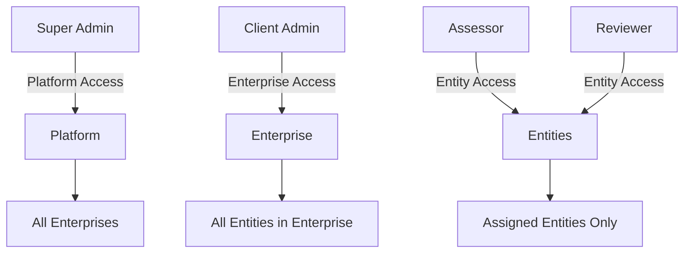

## Overview

Risk Legion implements Role-Based Access Control (RBAC) at multiple layers: API middleware, database Row-Level Security (RLS), and frontend route protection. This multi-layer approach ensures comprehensive security.

## Role Hierarchy



## User Roles

### Super Admin

| Aspect | Description |
|--------|-------------|
| **Scope** | Platform-wide |
| **Purpose** | Platform operations and enterprise management |
| **Data Access** | Enterprise metadata only, no business data |
| **Stored In** | `super_admins` table |

### Client Admin

| Aspect | Description |
|--------|-------------|
| **Scope** | Single enterprise |
| **Purpose** | Enterprise administration and BRA approval |
| **Data Access** | All data within their enterprise |
| **Stored In** | `enterprise_users` (role = 'admin') |

### Assessor

| Aspect | Description |
|--------|-------------|
| **Scope** | Assigned entities within enterprise |
| **Purpose** | Create and conduct BRAs |
| **Data Access** | Assigned Legal Entities/Business Units only |
| **Stored In** | `enterprise_users` (role = 'assessor') + `user_entity_roles` |

### Reviewer

| Aspect | Description |
|--------|-------------|
| **Scope** | Assigned entities within enterprise |
| **Purpose** | Read-only review and audit |
| **Data Access** | Assigned Legal Entities/Business Units only (read-only) |
| **Stored In** | `enterprise_users` (role = 'reviewer') + `user_entity_roles` |

## Permission Matrix

### BRA Operations

| Operation | Super Admin | Client Admin | Assessor | Reviewer |
|-----------|:-----------:|:------------:|:--------:|:--------:|
| List BRAs | ❌ | ✅ All | ✅ Assigned | ✅ Assigned |
| View BRA | ❌ | ✅ | ✅ Assigned | ✅ Assigned |
| Create BRA | ❌ | ✅ | ✅ | ❌ |
| Edit BRA | ❌ | ✅ | ✅ Own | ❌ |
| Approve BRA | ❌ | ✅ | ❌ | ❌ |
| Cancel BRA | ❌ | ✅ | ❌ | ❌ |

### Governance Operations

| Operation | Super Admin | Client Admin | Assessor | Reviewer |
|-----------|:-----------:|:------------:|:--------:|:--------:|
| View Legal Entities | ❌ | ✅ | ✅ Assigned | ✅ Assigned |
| Create Legal Entities | ❌ | ✅ | ❌ | ❌ |
| Manage Risk Library | ❌ | ✅ | ❌ | ❌ |
| Configure Risk Appetite | ❌ | ✅ | ❌ | ❌ |

### Admin Operations

| Operation | Super Admin | Client Admin | Assessor | Reviewer |
|-----------|:-----------:|:------------:|:--------:|:--------:|
| Create Enterprise | ✅ | ❌ | ❌ | ❌ |
| View All Enterprises | ✅ | ❌ | ❌ | ❌ |
| Create Client Admin | ✅ | ❌ | ❌ | ❌ |
| Create Assessor/Reviewer | ❌ | ✅ | ❌ | ❌ |
| View Audit Logs | ❌ | ✅ | ❌ | ✅ |

## RBAC Implementation Layers

### Layer 1: API Middleware

```python
# backend/app/middleware/auth.py

from functools import wraps
from fastapi import HTTPException

def require_role(*allowed_roles):
    def decorator(func):
        @wraps(func)
        async def wrapper(*args, **kwargs):
            user = kwargs.get('current_user')
            
            if user.role not in allowed_roles:
                raise HTTPException(
                    status_code=403,
                    detail=f"Role '{user.role}' not authorized for this action"
                )
            
            return await func(*args, **kwargs)
        return wrapper
    return decorator

# Usage
@app.post("/api/v1/bras/{bra_id}/approve")
@require_role("admin")
async def approve_bra(bra_id: str, current_user: User = Depends(get_current_user)):
    # Only Client Admins can reach here
    pass
```

### Layer 2: Database RLS

```sql
-- Enterprise isolation
CREATE POLICY "enterprise_isolation" ON business_risk_assessments
FOR ALL
USING (
    enterprise_id = (
        SELECT enterprise_id FROM enterprise_users
        WHERE user_id = auth.uid()
        LIMIT 1
    )
);

-- Entity-level access for Assessors
CREATE POLICY "assessor_entity_access" ON business_risk_assessments
FOR SELECT
USING (
    -- Admins see all
    EXISTS (
        SELECT 1 FROM enterprise_users
        WHERE user_id = auth.uid() AND role = 'admin'
    )
    OR
    -- Assessors/Reviewers see only assigned entities
    legal_entity_id IN (
        SELECT legal_entity_id FROM user_entity_roles
        WHERE user_id = auth.uid()
    )
);

-- Write restrictions
CREATE POLICY "assessor_write_access" ON business_risk_assessments
FOR INSERT
WITH CHECK (
    EXISTS (
        SELECT 1 FROM enterprise_users
        WHERE user_id = auth.uid()
        AND role IN ('admin', 'assessor')
    )
);
```

### Layer 3: Frontend Route Protection

```typescript
// ProtectedRoute.tsx
import { Navigate } from 'react-router-dom';
import { useAuth } from '@/hooks/useAuth';

interface ProtectedRouteProps {
  children: React.ReactNode;
  requiredRoles?: string[];
}

export function ProtectedRoute({ children, requiredRoles }: ProtectedRouteProps) {
  const { user, role, isLoading } = useAuth();
  
  if (isLoading) {
    return <LoadingSpinner />;
  }
  
  if (!user) {
    return <Navigate to="/login" />;
  }
  
  if (requiredRoles && !requiredRoles.includes(role)) {
    return <Navigate to="/unauthorized" />;
  }
  
  return <>{children}</>;
}

// Usage in routes
<Route 
  path="/admin" 
  element={
    <ProtectedRoute requiredRoles={['super_admin']}>
      <AdminDashboard />
    </ProtectedRoute>
  } 
/>
```

## Entity Assignment

### Assigning Entities to Users

```sql
-- user_entity_roles table
CREATE TABLE user_entity_roles (
    id UUID PRIMARY KEY DEFAULT gen_random_uuid(),
    user_id UUID NOT NULL REFERENCES profiles(id),
    enterprise_id UUID NOT NULL REFERENCES enterprises(id),
    legal_entity_id UUID REFERENCES legal_entities(id),
    business_unit_id UUID REFERENCES business_units(id),
    created_at TIMESTAMPTZ DEFAULT NOW()
);

-- Assign user to specific Legal Entity
INSERT INTO user_entity_roles (user_id, enterprise_id, legal_entity_id)
VALUES ('user-uuid', 'enterprise-uuid', 'legal-entity-uuid');

-- Assign user to specific Business Unit
INSERT INTO user_entity_roles (user_id, enterprise_id, business_unit_id)
VALUES ('user-uuid', 'enterprise-uuid', 'business-unit-uuid');
```

### Checking User Access

```python
async def check_entity_access(user_id: str, legal_entity_id: str) -> bool:
    # Check if user is admin (has access to all)
    user = await get_enterprise_user(user_id)
    if user.role == 'admin':
        return True
    
    # Check specific entity assignment
    assignments = await get_user_entity_roles(user_id)
    return any(
        a.legal_entity_id == legal_entity_id 
        for a in assignments
    )
```

## Role Resolution

### Getting User Role

```python
async def get_user_role(user_id: str) -> dict:
    # Check super admin first
    super_admin = await db.super_admins.get(user_id=user_id)
    if super_admin:
        return {"role": "super_admin", "scope": "platform"}
    
    # Get enterprise role
    enterprise_user = await db.enterprise_users.get(user_id=user_id)
    if not enterprise_user:
        raise HTTPException(status_code=403, detail="No role assigned")
    
    return {
        "role": enterprise_user.role,
        "enterprise_id": enterprise_user.enterprise_id,
        "scope": "enterprise" if enterprise_user.role == "admin" else "entity"
    }
```

### Applying Role to Queries

```python
async def get_bras(current_user: User):
    base_query = db.bras.select()
    
    # Apply enterprise filter
    base_query = base_query.filter(
        enterprise_id=current_user.enterprise_id
    )
    
    # Apply entity filter for non-admins
    if current_user.role != 'admin':
        entity_ids = await get_user_assigned_entities(current_user.id)
        base_query = base_query.filter(
            legal_entity_id__in=entity_ids
        )
    
    return await base_query.execute()
```

## Audit Logging

All permission checks are logged:

```python
async def log_access_attempt(
    user_id: str,
    action: str,
    resource: str,
    resource_id: str,
    allowed: bool
):
    await db.audit_log.insert({
        "user_id": user_id,
        "action_type": "access_check",
        "entity_type": resource,
        "entity_id": resource_id,
        "action_details": {
            "action": action,
            "allowed": allowed
        },
        "status": "success" if allowed else "denied"
    })
```

## Best Practices

<AccordionGroup>
  <Accordion title="Principle of Least Privilege">
    - Grant minimum necessary permissions
    - Use specific entity assignments
    - Regularly review access
    - Remove access promptly when roles change
  </Accordion>
  
  <Accordion title="Defense in Depth">
    - Implement RBAC at all layers
    - Don't trust frontend-only validation
    - Use database RLS as final guard
    - Log all access attempts
  </Accordion>
  
  <Accordion title="Role Management">
    - Document role responsibilities
    - Train users on their permissions
    - Audit role assignments regularly
    - Use clear role naming
  </Accordion>
  
  <Accordion title="Testing">
    - Test each role's access paths
    - Verify denial cases
    - Test entity-level isolation
    - Regular security reviews
  </Accordion>
</AccordionGroup>

## Related Documentation

- [Authentication](/architecture/authentication) - How users authenticate
- [Database Schema](/architecture/database-schema) - Tables and RLS policies
- [User Roles](/guides/roles/super-admin) - Detailed role documentation
