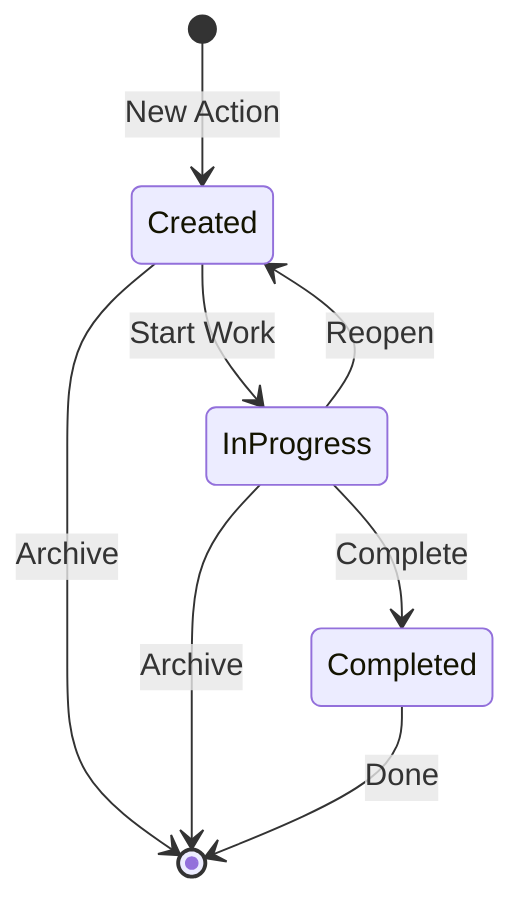

## Overview

Action Plans in Risk Legion track mitigation activities for identified risks. Actions can be created manually or automatically generated when risks exceed appetite or controls are found to be ineffective.

## Action Plan Lifecycle



### Action Statuses

| Status | Description |
|--------|-------------|
| **Created** | Action has been defined but work hasn't started |
| **In Progress** | Action is being actively worked on |
| **Completed** | Action has been finished |

## Creating Actions

### Manual Creation

Create actions directly from the Action Plans page:

1. Navigate to **Mitigation → Action Plans**
2. Click **Create Action**
3. Fill in the action details:

| Field | Description | Required |
|-------|-------------|----------|
| Action | Description of what needs to be done | Yes |
| Owner | Person responsible for the action | Yes |
| Due Date | Target completion date | Yes |
| Priority | Low, Medium, High, or Critical | Yes |
| Action Type | Category of action (e.g., Process, Technology) | Yes |
| BRA | Link to related BRA (optional) | No |
| Risk Scenario | Link to specific scenario (optional) | No |

### Automatic Creation

Risk Legion can automatically create actions when:

<CardGroup cols={2}>
  <Card title="Risk Above Appetite" icon="triangle-exclamation">
    When residual risk exceeds the defined risk appetite threshold, a mitigation action is suggested
  </Card>
  <Card title="Ineffective Control" icon="shield-xmark">
    When a control is rated "Not Effective" or "Less Effective", a remediation action is created
  </Card>
</CardGroup>

Auto-created actions include:
- Link to source BRA and scenario
- Suggested action description based on context
- Default priority based on risk level
- Clear indicator that action was auto-generated

### From BRA Workspace

Create actions while reviewing a BRA:

1. In the BRA workspace, go to **Review & Finalize**
2. View the **Mitigation Summary** section
3. Click **Create Action** next to any risk above appetite
4. Action is automatically linked to the BRA and scenario

## Managing Actions

### Unified Action List

The Action Plans page provides a unified view of all actions:

**Statistics Bar:**
- Total actions
- Created (not started)
- In Progress
- Completed
- Overdue

**Filtering Options:**
| Filter | Options |
|--------|---------|
| Status | Created, In Progress, Completed |
| Priority | Low, Medium, High, Critical |
| Owner | Text search |
| Due Date | Date range picker |
| Overdue Only | Toggle |
| Entity | Legal Entity / Business Unit |

### Updating Actions

To update an action:

1. Click on the action row to open details
2. Modify any editable field
3. Click **Save Changes**

**Editable Fields:**
- Action description
- Owner
- Due date
- Priority
- Status

<Note>
Source links (BRA, Risk Scenario) cannot be modified after creation.
</Note>

### Bulk Operations

Perform bulk updates on multiple actions:

1. Select multiple actions using checkboxes
2. Click **Bulk Update**
3. Choose the field to update (Status, Owner)
4. Apply changes

```json
POST /api/v1/mitigation-actions/bulk-update
{
  "action_ids": ["act-001", "act-002", "act-003"],
  "updates": {
    "status": "in_progress"
  }
}
```

## Due Dates and Overdue Actions

### Setting Due Dates

Due dates should be:
- Realistic based on action complexity
- Aligned with risk urgency
- Coordinated with resource availability

<Warning>
Due dates must be in the future when creating an action. Past dates are not allowed.
</Warning>

### Overdue Detection

Actions are automatically flagged as overdue when:
```
Due Date < Current Date AND Status ≠ Completed
```

Overdue actions are:
- Highlighted in the action list
- Counted in dashboard metrics
- Shown in the "Overdue Actions" KPI card

### Extending Due Dates

To extend a due date:

1. Open the action details
2. Select a new due date
3. Provide a reason (recommended)
4. Save changes

All due date changes are logged in the audit trail.

## Action Priorities

| Priority | When to Use | SLA Guidance |
|----------|-------------|--------------|
| **Critical** | Immediate risk to business, regulatory deadline | 1-2 weeks |
| **High** | Significant risk exposure, important deadline | 2-4 weeks |
| **Medium** | Moderate risk, standard operations | 4-8 weeks |
| **Low** | Minor risk, improvement opportunity | 8+ weeks |

<Tip>
Priority should align with the risk level of the underlying risk scenario. A "Very High" risk should typically have "Critical" or "High" priority actions.
</Tip>

## Action Types

Categorize actions by type for better tracking:

| Type | Description |
|------|-------------|
| **Process** | Changes to business processes or procedures |
| **Technology** | System changes, automation, tools |
| **Training** | Staff training and awareness |
| **Policy** | Policy updates or new policies |
| **Control** | New or enhanced controls |
| **Monitoring** | Enhanced monitoring or reporting |
| **Other** | Actions not fitting other categories |

## Dashboard Integration

Action metrics appear on the main dashboard:

### KPI Cards
- **Overdue Actions** - Count with trend indicator
- **Actions This Month** - Recently created actions

### Operational Overview
- Actions by status breakdown
- Actions by priority distribution

### Drill-Down
Click on any metric to navigate to filtered action list.

## Archiving Actions

Soft delete actions that are no longer relevant:

1. Click the archive icon on an action
2. Confirm the archive
3. Action is removed from active list

**Restoring Archived Actions:**
1. Toggle **Show Archived** in filters
2. Find the archived action
3. Click the restore icon
4. Action returns to active list

<Info>
Archived actions are retained for audit purposes and can be restored at any time.
</Info>

## Best Practices

<AccordionGroup>
  <Accordion title="Clear Action Descriptions">
    Write actions that are:
    - Specific and measurable
    - Actionable (start with a verb)
    - Time-bound (via due date)
    - Clearly assigned (single owner)
    
    **Good:** "Implement MFA for admin users by March 31"  
    **Bad:** "Improve security"
  </Accordion>
  
  <Accordion title="Appropriate Prioritization">
    - Align priority with risk severity
    - Consider regulatory deadlines
    - Balance with resource capacity
    - Review priorities regularly
  </Accordion>
  
  <Accordion title="Owner Accountability">
    - Assign to individuals, not teams
    - Ensure owner has authority to act
    - Communicate expectations clearly
    - Follow up on progress
  </Accordion>
  
  <Accordion title="Regular Reviews">
    - Review action status weekly
    - Escalate overdue actions
    - Adjust due dates proactively
    - Close completed actions promptly
  </Accordion>
</AccordionGroup>

## API Reference

| Endpoint | Method | Description |
|----------|--------|-------------|
| `/api/v1/mitigation-actions` | GET | List actions with filters |
| `/api/v1/mitigation-actions` | POST | Create new action |
| `/api/v1/mitigation-actions/{id}` | GET | Get action details |
| `/api/v1/mitigation-actions/{id}` | PATCH | Update action |
| `/api/v1/mitigation-actions/{id}/archive` | POST | Archive action |
| `/api/v1/mitigation-actions/bulk-update` | POST | Bulk update actions |

### Example: Create Action

```bash
curl -X POST /api/v1/mitigation-actions \
  -H "Authorization: Bearer $TOKEN" \
  -d '{
    "action": "Implement MFA for all administrative access",
    "owner": "john.smith@example.com",
    "priority": "high",
    "action_type": "Technology",
    "due_date": "2026-03-31",
    "bra_id": "bra-001",
    "bra_risk_scenario_id": "brs-001"
  }'
```

### Example: Get Overdue Actions

```bash
curl -X GET "/api/v1/mitigation-actions?overdue_only=true&status=created,in_progress" \
  -H "Authorization: Bearer $TOKEN"
```

See [API Reference](/api-reference/introduction) for complete documentation.
