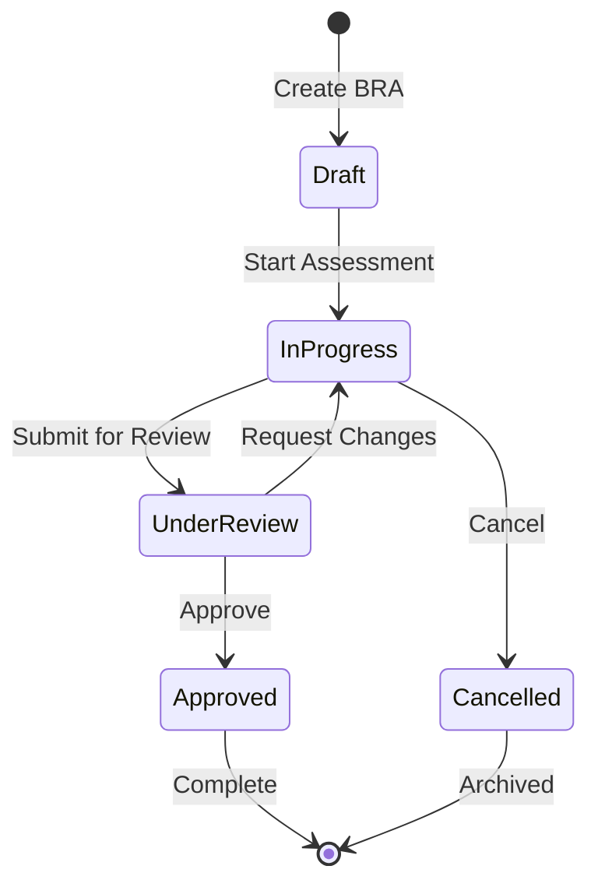

## Overview

Business Risk Assessment (BRA) is the core workflow in Risk Legion for identifying, evaluating, and managing business risks across your organization. A BRA systematically assesses risk scenarios against your organizational structure, links controls, and produces actionable insights.

## Key Concepts

### What is a BRA?

A Business Risk Assessment is a structured evaluation that:
- Assesses risk scenarios relevant to specific Legal Entities and Business Units
- Captures both **Inherent Risk** (before controls) and **Residual Risk** (after controls)
- Links key controls and sub-controls to risk scenarios
- Tracks risk triggers that may indicate elevated risk
- Generates mitigation actions for risks above appetite

### BRA Lifecycle



| Status | Description |
|--------|-------------|
| **Draft** | Initial creation, not yet started |
| **In Progress** | Active assessment work |
| **Under Review** | Submitted for approval |
| **Approved** | Finalized and immutable |
| **Cancelled** | Discontinued with reason |

## Creating a BRA

### Step 1: Initialize the BRA

Navigate to **BRAs → Create New BRA** and provide:

| Field | Description | Required |
|-------|-------------|----------|
| Name | Descriptive name (e.g., "Q1 2026 Retail Banking Assessment") | Yes |
| Legal Entity | The legal entity being assessed | Yes |
| Business Unit | Specific business unit within the entity | Optional |
| Assessment Period | Time period covered (e.g., "Q1 2026") | Yes |
| Assessor | Person responsible for the assessment | Yes |

<Tip>
When you create a BRA, the system automatically creates an initial snapshot capturing the state at creation time. This enables historical comparison.
</Tip>

### Step 2: Select Risk Scenarios

After creating the BRA, you'll be directed to the Risk Scenarios tab where you can:

1. **Browse the Risk Library** - View all available risk scenarios
2. **Filter by Category** - ML, TF, Fraud, Sanctions, Operational, etc.
3. **Include/Exclude Scenarios** - Toggle scenarios relevant to this assessment
4. **View Linked Products** - See which products each scenario applies to

<Note>
Only risk scenarios linked to products assigned to the selected Legal Entity/Business Unit will appear as relevant.
</Note>

### Step 3: Assess Inherent Risk

For each included scenario, rate the **Inherent Risk** (risk before considering controls):

| Rating | Impact Scale | Likelihood Scale |
|--------|--------------|------------------|
| 1 | Insignificant | Rare |
| 2 | Minor | Unlikely |
| 3 | Moderate | Possible |
| 4 | Major | Likely |
| 5 | Catastrophic | Almost Certain |

**Risk Score Calculation:**
```
Risk Score = Impact × Likelihood (1-25)
```

**Risk Level Mapping:**
| Score | Level |
|-------|-------|
| 1-4 | Low |
| 5-9 | Medium |
| 10-15 | High |
| 16-25 | Very High |

<Warning>
You must provide a justification for each inherent risk rating. This is required for audit purposes.
</Warning>

### Step 4: Link Controls

For each risk scenario, link the relevant Key Controls and Sub-Controls:

1. **Key Controls** - High-level control categories
2. **Sub-Controls** - Specific control instances with ToD/ToE assessments

The system will suggest controls that are already linked to the risk scenario in the Risk Library.

### Step 5: Assess Control Effectiveness

For each linked control, assess:

| Assessment | Scale | Description |
|------------|-------|-------------|
| **Test of Design (ToD)** | A-E | How well is the control designed? |
| **Test of Effectiveness (ToE)** | 1-5 | How effective is the control in practice? |

See [Control Assurance](/guides/control-assurance) for detailed guidance.

### Step 6: Assess Residual Risk

After considering control effectiveness, rate the **Residual Risk**:

- Residual risk should typically be lower than inherent risk
- If controls are ineffective, residual may equal inherent risk
- Justification must explain how controls mitigate the risk

### Step 7: Add Risk Triggers

Link relevant risk triggers to each scenario. Triggers are indicators that may signal elevated risk:

- Economic indicators (unemployment, inflation)
- Regulatory events (inspection notices, new regulations)
- Operational events (system outages, fraud incidents)
- Market events (interest rate changes, currency fluctuations)

### Step 8: Review and Finalize

The **Review & Finalize** tab shows:

- **Executive Summary** - Overall risk profile
- **Key Findings** - Scenarios requiring attention
- **Risks Above Appetite** - Scenarios exceeding risk tolerance
- **Mitigation Summary** - Recommended actions
- **Attestation** - Sign-off checkbox

## BRA Approval Workflow

### Submission

When the assessment is complete:
1. Navigate to the **Review & Finalize** tab
2. Verify all scenarios have been rated
3. Check the attestation checkbox
4. Click **Submit for Approval**

### Approval (Client Admin Only)

Client Admins can approve submitted BRAs:
1. Review the complete assessment
2. Add approval comments
3. Click **Approve**

<Info>
Upon approval, the system creates an **immutable snapshot** containing all assessment data. This snapshot cannot be modified and serves as the permanent record.
</Info>

### Post-Approval

After approval:
- BRA becomes read-only
- Data is copied to `le_assessed_risk_scenarios` (Layer 2)
- Future BRAs can pre-fill from this assessment
- Mitigation actions are automatically generated for risks above appetite

## BRA Workspace

The BRA Workspace consists of three tabs:

### Tab 1: Risk Scenarios

- View all risk scenarios for the BRA
- See inherent/residual risk ratings
- Progress indicators show assessment completion
- Filter by category, risk level, assessment status

### Tab 2: Controls

- View all controls linked to scenarios
- Accordion view groups sub-controls under key controls
- ToD/ToE ratings displayed with color-coded badges
- Quick stats show assessed vs. total controls

### Tab 3: Review & Finalize

- Executive summary of the assessment
- Key findings and attention items
- Mitigation action summary
- Approval workflow controls

## Best Practices

<AccordionGroup>
  <Accordion title="Plan Your Assessment">
    Before starting, gather information about:
    - Products offered by the business unit
    - Recent incidents or near-misses
    - Regulatory changes affecting the entity
    - Control testing results from the period
  </Accordion>
  
  <Accordion title="Be Consistent with Ratings">
    Use the same rating criteria across all scenarios:
    - Reference your organization's risk rating guidelines
    - Consider both quantitative and qualitative impacts
    - Document assumptions in justifications
  </Accordion>
  
  <Accordion title="Link Relevant Controls">
    Ensure all mitigating controls are linked:
    - Include both preventive and detective controls
    - Don't forget manual controls (committees, reviews)
    - Consider IT and operational controls
  </Accordion>
  
  <Accordion title="Write Clear Justifications">
    Each justification should:
    - Explain the reasoning for the rating
    - Reference specific data or evidence
    - Be auditable and defensible
  </Accordion>
</AccordionGroup>

## API Reference

| Endpoint | Method | Description |
|----------|--------|-------------|
| `/api/v1/bras` | GET | List all BRAs |
| `/api/v1/bras` | POST | Create new BRA |
| `/api/v1/bras/{id}` | GET | Get BRA details |
| `/api/v1/bras/{id}` | PATCH | Update BRA |
| `/api/v1/bras/{id}/approve` | POST | Approve BRA |
| `/api/v1/bras/{id}/cancel` | POST | Cancel BRA |
| `/api/v1/bras/{id}/scenarios` | GET/POST | Manage scenarios |
| `/api/v1/bras/{id}/ratings` | GET/POST | Manage ratings |

See [API Reference](/api-reference/introduction) for complete documentation.
